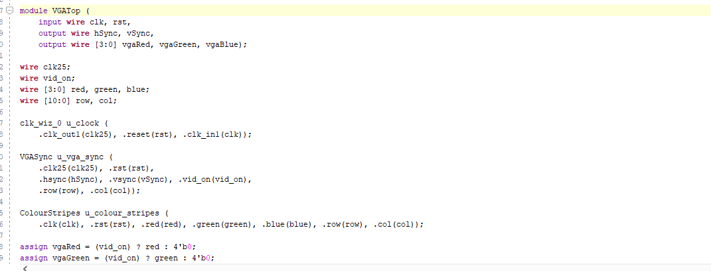
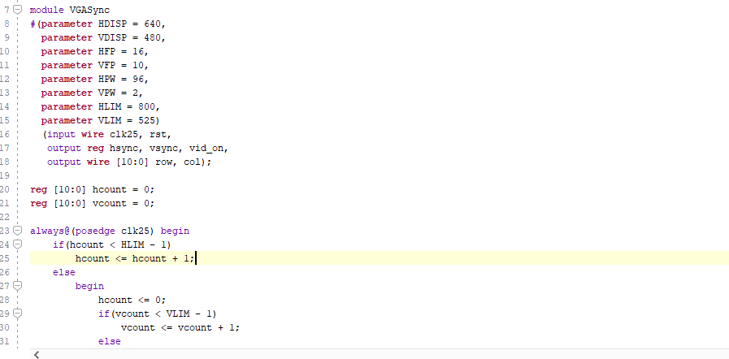

For this project I chose an image that I wanted to display on the screen, for my image i chose the S from Shrek. I started by opening the colour stripes code we had gotten as a sample and adapted it to my own.
This included initializing a clock aswell.

## **Template VGA Design**
### **Project Set-Up**
I began my project by creating a new Vivado project. I included source files and a testbench given to me by my lecturer. This was really helpful to build a foundation to work off of.
For the first exercise I had to generate the clock. we did this using the ip catalog and set it to 25MHz. I will include an image of my project summary below.

### **Template Code**
Our leturer gave us a template code for a colour stripes display. At first I looked at this code and had no idea what any of it meant as you would expect, but it didnt take long for me to gain an understanding.
This code included columns of an even width that displayed all different colours. I first started editing the rgb outputs to see what colours would be displayed and quickly learned that you can include more or less of the colours using the 4 bit binary code, This also meant you could mix colours to create others such as red and green to make yellow in many different shades based on how much red or green.

There was also different simulation sources such as VGA top and vga sync. VGA top included code to declare rows and columns and VGA Sync included code for the display size and refresh rate. I will include screenshots of both below.

#### **VGA Top**

#### **VGA Sync**

### **Simulation**
I first simulated the colour stripes to see how it was done. To simulate I saved the edited code and generated a bitstream. I connected the board to the monitor using a VGA cable and also connected the board to the PC to allow me to program it. After doing this the bitstream was generated so I would be able to open and connect to the board before programming it. Once i programmed the board the monitor displayed the colour stripes.
Once the first simulation was complete I could edit the code, save it, re-generate the bitstream and then re-program the device before seeing changes.
### **Synthesis**

Describe the synthesis and implementation processes. Consider including 1/2 useful screenshot(s). Guideline: 1/2 short paragraphs.
### **Demonstration**

## **My VGA Design Edit**
For my VGA design I decided to make the S from shrek. I chose this as I saw it as challenging but acheiveable. I found an image online and deicded to use it as a baseline to base my design around.
This image had already included a grid in it so I decided to make it 25 x 25 pixel grid as that would suit my project based on the display being 640 x 480.

### **Code Adaptation**
Briefly show how you changed the template code to display a different image. Demonstrate your understanding. Guideline: 1-2 short paragraphs.
### **Simulation**
 It took longer and loner to generate the bitstream as I went on with my project as the code was growing so I would only be able to see my changes after a long period of time, this was not ideal if I made a mistake as I wouldnt realise for a while. It is important to make sure the code you are writing is correct. I will include a picture of my hardware manager while running a simulation
### **Synthesis**
Describe the synthesis & implementation outputs for your design, are there any differences to that of the original design? Guideline 1-2 short paragraphs.
### **Demonstration**
If you get your own design working on the Basys3 board, take a picture! Guideline: 1-2 sentences.

## **More Markdown Basics**
This is a paragraph. Add an empty line to start a new paragraph.

Font can be emphasised as *Italic* or **Bold**.

Code can be highlighted by using `backticks`.

Hyperlinks look like this: [GitHub Help](https://help.github.com/).

A bullet list can be rendered as follows:
- vectors
- algorithms
- iterators

Images can be added by uploading them to the repository in a /docs/assets/images folder, and then rendering using HTML via githubusercontent.com as shown in the example below.

